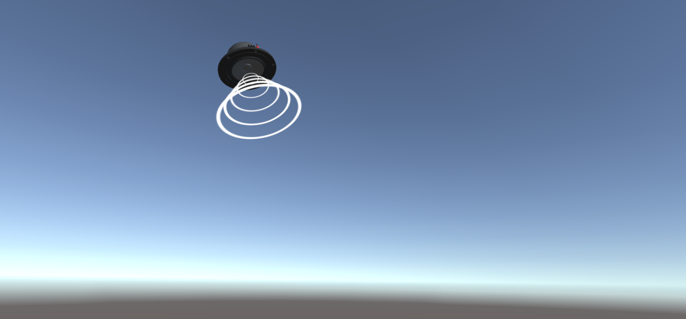

# Unity-Spatial-Audio-XR-Oculus
An Oculus VR demonstration for spatial audio

Based on https://github.com/cantinac/unity-spatial-audio-demo

* Reduced speakers to 1
* Add play on awake to spatialize audio, working around a unity bug
* Added XR Camera

Steps to use:
* Import project into Unity with the latest beta release editor (2022 and up)
* Run the Oculus app and connect your headset
* Press play

## Unity Plugins

| Name | URL |
| ---- | --- |
| Unity (default) | <https://docs.unity3d.com/Manual/AudioSpatializerSDK.html> |
| Oculus Spatializer Unity | <https://developer.oculus.com/downloads/package/oculus-spatializer-unity/> |
| Google Resonance Audio | <https://resonance-audio.github.io/resonance-audio/> |
| Steam Audio | <https://valvesoftware.github.io/steam-audio/downloads> |
| Microsoft MixedRealityToolkit | <https://github.com/Microsoft/MixedRealityToolkit-Unity/tree/master/Assets/HoloToolkit/SpatialSound> |
| Tazman-Audio's Microsoft Audio Spatializer | <https://developer.dolby.com/blog/tazman-audio-unity-plugin-for-atmos/> , <https://assetstore.unity.com/packages/tools/audio/microsoft-audio-spatializer-116094> |
